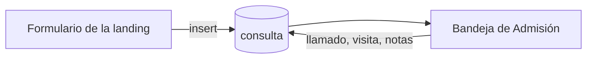

# Admisión: modelo de consultas

Este documento define el alcance acordado para el módulo de admisión. A diferencia
del módulo de residentes, acá la base de datos ya existe: la landing de la
residencia escribe consultas en producción desde antes de que el CRM pudiera
leerlas.

## El circuito



Una familia deja sus datos en la web de la residencia. Eso crea una fila en
`public.consulta`. Desde ahí el trabajo es del equipo de admisión: llamar, y si
la conversación avanza, agendar una visita presencial a la residencia.

**La familia no reserva el turno.** Solo indica en qué momento del día le queda
cómodo que la llamen. La visita la agenda admisión desde el CRM después de
hablar, y se guarda en la misma fila de la consulta. Esto es deliberado: quien
conoce la disponibilidad real de la residencia es el equipo, no la familia.

## Objetivo de la primera entrega

1. Ver las consultas entrantes ordenadas de la más reciente a la más antigua.
2. Filtrar por estado.
3. Marcar una consulta como contactada después de llamar.
4. Agendar la visita presencial: día y franja horaria.
5. Reprogramar o cancelar esa visita.
6. Cerrar la consulta como ingreso o como descartada.
7. Guardar notas internas del equipo en cualquier momento.

Queda para entregas posteriores la vista de agenda por día y la conversión de una
consulta con estado `ingreso` en un residente con su primer ingreso.

## Reglas acordadas

- Una consulta entra siempre desde afuera; el CRM no las crea.
- Una consulta nunca se elimina: se descarta.
- La visita tiene día y franja, o no tiene ninguno de los dos.
- Solo puede haber una visita agendada por día y franja.
- Cerrar o descartar una consulta libera ese turno, pero conserva la fecha como
  historia de lo que pasó.
- Las notas internas no las ve nunca la familia.
- Las consultas contienen datos personales de terceros y no se usan datos reales
  durante las pruebas.

## Estados

| Estado | Significado |
| --- | --- |
| `nuevo` | Entró la consulta y todavía nadie llamó. Es el estado inicial. |
| `contactado` | El equipo ya habló con la familia. |
| `visita_agendada` | Hay día y franja confirmados para la visita presencial. |
| `ingreso` | La consulta terminó en un ingreso a la residencia. |
| `descartada` | No va a avanzar. |

```text
nuevo ──> contactado ──> visita_agendada ──> ingreso
  │            │                │
  └────────────┴────────────────┴──────────> descartada ──> nuevo
```

`visita_agendada` no se alcanza cambiando el estado a mano: se llega agendando la
visita, porque el estado y las dos columnas de la visita tienen que moverse
juntos. Cancelar la visita devuelve la consulta a `contactado` y borra el día y
la franja.

Las transiciones directas son: `nuevo` → `contactado` o `descartada`,
`contactado` → `nuevo` o `descartada`, `visita_agendada` → `ingreso` o
`descartada`, `ingreso` → `contactado` y `descartada` → `nuevo`. Agendar está
permitido desde `nuevo`, `contactado` y `visita_agendada`; cancelar solo desde
`visita_agendada`. Las notas se pueden modificar en cualquier estado.

## Escrituras y concurrencia

Las cuatro acciones del CRM llaman a `update_consulta`, con la identidad,
el estado esperado y `actualizado_en` tal como llegaron al formulario. La
aplicación conserva el timestamp como texto para no perder microsegundos.

La función bloquea la fila, comprueba el estado y la versión, valida la acción
y guarda el cambio dentro de la misma transacción. Las transiciones se validan
en TypeScript para dar mensajes claros y también en Postgres para garantizar
las reglas. No se permite `update` directo a `service_role`; la landing
conserva `insert` y no necesita cambiar su formulario.

El trigger genera una versión estrictamente creciente en cada escritura,
incluso dentro de una misma transacción. Esto detecta reprogramaciones sin
cambio de estado y secuencias que vuelven al estado original. También protege
las notas contra sobrescrituras desde otra pestaña.

Si la versión o el estado no coinciden, se devuelve `consulta_changed`
(`40001`). El CRM pide recargar la página y no reintenta con una versión nueva
ni informa éxito. Si no existe la consulta, se devuelve `consulta_not_found`
(`P0002`). El índice de turno único sigue resolviendo los choques entre
consultas diferentes.

Los formularios se renuevan cuando reciben una versión distinta, para que los
campos visibles y la versión enviada correspondan a los mismos datos.

Los cambios de agenda conservan ahora el turno anterior y nuevo, acción,
momento y autor en `visit_events`, dentro de la misma transacción.
El historial sobrescrito previamente no se reconstruye.
Ver [historial de visitas](admision-historial.md).

## Tabla `consulta`

El nombre está en español, a diferencia de lo previsto en
[el modelo de residentes](residentes-modelo-inicial.md). La tabla ya está en
producción y la escribe una landing deployada: renombrarla rompería el formulario
para ganar consistencia de nomenclatura. Se mantiene el nombre y esta queda como
una excepción documentada, no como el criterio general del proyecto.

### Campos que llegan del formulario

| Campo | Tipo | Obligatorio | Descripción |
| --- | --- | --- | --- |
| `nombre` | `text` | Sí | Nombre y apellido de quien consulta. Entre 2 y 80 caracteres. |
| `telefono` | `text` | Sí | Teléfono de contacto. Entre 6 y 30 caracteres. |
| `momento_llamado` | `text` | Sí | Cuándo le queda cómodo atender: `manana`, `tarde` o `indistinto`. |
| `mensaje` | `text` | No | Texto libre de la familia. Hasta 1000 caracteres. |
| `origen` | `text` | Sí | Canal de entrada. Por defecto `landing`. |

### Campos de gestión

| Campo | Tipo | Obligatorio | Descripción |
| --- | --- | --- | --- |
| `id` | `uuid` | Sí | Identificador generado por la base. |
| `estado` | `text` | Sí | Uno de los cinco estados. Por defecto `nuevo`. |
| `notas_internas` | `text` | No | Observaciones del equipo. |
| `visita_fecha` | `date` | No | Día de la visita presencial. La carga el CRM. |
| `visita_franja` | `text` | No | Franja de la visita: `manana` o `tarde`. |
| `creado_en` | `timestamptz` | Sí | Momento en que entró la consulta. |
| `actualizado_en` | `timestamptz` | Sí | Última modificación, mantenida por un trigger. |

`origen` existe para distinguir campañas o canales más adelante. Hoy la landing no
lo envía, así que todas las filas caen en el valor por defecto.

## Garantías que viven en la base

**La visita va completa o no va.** La restricción `consulta_visita_completa`
exige que `visita_fecha` y `visita_franja` sean ambas nulas o ambas no nulas. Una
fecha sin franja no sirve para nada.

**Un solo turno por día y franja.** El índice único parcial
`consulta_visita_unica` cubre `(visita_fecha, visita_franja)` solo mientras el
estado es `visita_agendada`. Está en la base y no en la aplicación a propósito: si
dos operadores agendan al mismo tiempo, una validación previa desde el código no
puede impedir que ambas pasen, y el índice sí.

Como consecuencia, mover una consulta fuera de `visita_agendada` libera el turno.
La aplicación tiene que traducir el error de la base a una explicación clara
—"ese turno ya está ocupado"— en lugar de mostrar un error técnico.

## Contrato compartido con la landing

Los valores de `momento_llamado` están escritos en tres lugares:

- las restricciones `check` de la tabla;
- `lib/content.ts` de la landing, que arma las opciones del formulario;
- las etiquetas en español del CRM.

Agregar o cambiar un valor obliga a tocar los tres. Es duplicación deliberada:
son dos aplicaciones deployadas por separado y no comparten código.

`visita_franja` no aparece en la landing: es un campo que solo escribe el CRM.

## Propiedad del esquema

geriatrIA es el sistema de registro, así que el esquema de `consulta` se versiona
acá, en `supabase/migrations/`. La landing solo inserta filas y no cambia la
estructura. Esto evita que dos repositorios apliquen cambios sobre la misma tabla
sin enterarse uno del otro.

La primera migración reproduce el esquema tal como ya está aplicado y es
idempotente, porque el script original se ejecutó a mano en el editor SQL antes de
que existiera este flujo. Aplicarla contra la base actual no cambia nada.

## Seguridad

La tabla tiene Row Level Security activada **sin políticas**, y `anon` y
`authenticated` tienen los permisos revocados. Nadie llega a estos datos con la
clave publicable sin sesión. Las lecturas usan la clave `service_role`, que
vive exclusivamente del lado del servidor, y la landing conserva INSERT.
La función `update_consulta` es `security definer`, tiene `search_path` vacío
y permite ejecución a `authenticated`, exigiendo `auth.uid()` para identificar
al autor. Las Server Actions la invocan con el cliente autenticado.
`anon` no puede invocarla. La tabla de eventos tiene RLS de lectura y
no permite escrituras directas.

Esa clave saltea RLS, así que la base no distingue quién está consultando. La
protección real del CRM es su autenticación: cada pantalla y cada acción que toque
esta tabla verifica la sesión antes de leer o escribir, sin confiar únicamente en
el middleware.

Cuando el proyecto tenga un modelo de roles, corresponderá reemplazar la clave
`service_role` por políticas RLS por rol. Hasta entonces, el login es la puerta.

## Pruebas y despliegue

`npm test` verifica validaciones, exigencia de sesión y tratamiento de
conflictos en las Server Actions. `npm run test:db` ejecuta pruebas pgTAP sobre
Supabase local: permisos, transiciones, versiones obsoletas, agenda, cancelación,
notas y conservación del turno único. Solo utiliza consultas ficticias y
revierte sus datos al terminar.

La migración cambia los permisos de escritura y requiere coordinar el despliegue
del CRM. Ver [aplicación y recuperación](admision-transiciones-despliegue.md).

## Próximo paso

Vista de agenda: los turnos de la semana en una grilla, para ver de un vistazo qué
franjas quedan libres antes de llamar a una familia. Después de eso, cómo una
consulta con estado `ingreso` se convierte en un residente con su primer ingreso.
