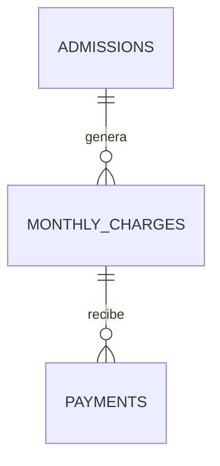

# Pagos: modelo inicial

Este documento define el alcance funcional y técnico de la primera versión del
módulo de pagos. La estructura de base ya está aplicada en Supabase; las
pantallas se incorporarán en incrementos posteriores.

## Estado de implementación

- Existen las tablas `monthly_charges` y `payments`.
- La vista `monthly_charge_balances` calcula importes pagados, saldos, estado y
  vencimiento sin guardar datos redundantes.
- Las funciones `create_monthly_charge`, `record_payment`, `void_payment` y
  `cancel_monthly_charge` concentran las escrituras financieras.
- RLS está habilitado y los usuarios autenticados sólo escriben mediante esas
  funciones; no tienen permisos directos de `INSERT`, `UPDATE` ni `DELETE`.
- Los tipos TypeScript están generados desde el esquema remoto.
- La consulta de cuentas y cuotas está disponible en `/contabilidad`, con
  acceso a estadías activas y finalizadas. Permite crear cuotas y registrar
  pagos totales o parciales, consultar movimientos y anular pagos o cuotas con
  motivo. El bucket privado de comprobantes todavía está pendiente.

## Objetivo

El sistema permitirá:

1. Crear una cuota para un mes determinado de una estadía.
2. Registrar uno o varios pagos sobre esa cuota.
3. Conocer el importe pagado y el saldo pendiente.
4. Distinguir cuotas pendientes, parciales, pagadas y vencidas.
5. Anular movimientos incorrectos sin eliminarlos.
6. Adjuntar opcionalmente una imagen del comprobante.

## Alcance de la primera versión

- Una cuota pertenece a una estadía (`admissions`), no directamente a la
  persona. Así, cada reingreso mantiene su propia cuenta.
- Existirá como máximo una cuota por estadía y período mensual.
- El importe de la cuota se copiará desde `admissions.monthly_fee` al crearla,
  pero el dueño podrá confirmarlo o ajustarlo antes de guardarla.
- Una cuota podrá recibir varios pagos parciales.
- Todos los importes usarán inicialmente pesos argentinos (`ARS`).
- Las cuotas se generarán manualmente, una por vez. La generación automática y
  masiva se evaluará cuando el flujo básico esté validado con usuarios reales.
- Los comprobantes serán opcionales y se guardarán como archivos privados.

Quedan fuera de esta versión la facturación fiscal, los egresos, los sueldos,
las conciliaciones bancarias, los reintegros automáticos, las pasarelas de pago
y los recordatorios de deuda.

## Por qué separamos cuota y pago

La cuota representa una obligación: cuánto corresponde pagar por un mes. El
pago representa un movimiento real de dinero. Si ambos datos estuvieran en una
misma fila, un pago parcial obligaría a sobrescribir información o a duplicar la
cuota.



## Tabla `monthly_charges`

Guarda la cuota mensual acordada para una estadía. El importe queda registrado
como una fotografía de ese período: cambiar la cuota del ingreso después no
modificará meses anteriores.

| Campo | Tipo previsto | Obligatorio | Descripción |
| --- | --- | --- | --- |
| `id` | `uuid` | Sí | Identificador generado por Supabase. |
| `admission_id` | `uuid` | Sí | Estadía a la que pertenece la cuota. |
| `period` | `date` | Sí | Primer día del mes representado, por ejemplo `2026-08-01`. |
| `due_date` | `date` | Sí | Fecha de vencimiento de esa cuota. |
| `amount_due` | `numeric(12, 2)` | Sí | Importe total a pagar en el período. |
| `currency` | `text` | Sí | Moneda; inicialmente `ARS`. |
| `notes` | `text` | No | Aclaraciones administrativas. |
| `created_by` | `uuid` | Sí | Usuario autenticado que creó la cuota. |
| `created_at` | `timestamptz` | Sí | Momento de creación. |
| `cancelled_at` | `timestamptz` | No | Momento de anulación de la cuota. |
| `cancelled_reason` | `text` | No | Motivo obligatorio cuando se anula. |
| `cancelled_by` | `uuid` | No | Usuario que realizó la anulación. |

Restricciones previstas:

- `admission_id` referencia `admissions.id` con borrado restringido.
- Sólo puede existir una cuota no anulada por `admission_id + period`. Una cuota
  anulada puede reemplazarse sin borrar su registro histórico.
- `period` debe ser siempre el primer día del mes.
- `amount_due` debe ser mayor que cero y respetar el límite de
  `numeric(12, 2)`.
- `currency` debe tener tres letras mayúsculas.
- Una cuota anulada debe incluir fecha, motivo y usuario de anulación.
- La cuota debe corresponder a un mes alcanzado por la estadía. No se crearán
  cuotas posteriores a una baja ni anteriores al ingreso.

## Tabla `payments`

Guarda cada movimiento aplicado a una cuota. Dos pagos parciales serán dos
filas diferentes y no una modificación del primer pago.

| Campo | Tipo previsto | Obligatorio | Descripción |
| --- | --- | --- | --- |
| `id` | `uuid` | Sí | Identificador generado por Supabase. |
| `monthly_charge_id` | `uuid` | Sí | Cuota sobre la que se imputa el pago. |
| `paid_on` | `date` | Sí | Día en que se recibió o acreditó el dinero. |
| `amount` | `numeric(12, 2)` | Sí | Importe pagado. |
| `payment_method` | `text` | Sí | Medio de pago normalizado. |
| `reference` | `text` | No | Número de operación o referencia externa. |
| `receipt_path` | `text` | No | Ruta privada de la imagen del comprobante. |
| `notes` | `text` | No | Observaciones administrativas. |
| `created_by` | `uuid` | Sí | Usuario autenticado que registró el pago. |
| `created_at` | `timestamptz` | Sí | Momento real de creación del registro. |
| `voided_at` | `timestamptz` | No | Momento en que se anuló el pago. |
| `voided_reason` | `text` | No | Motivo obligatorio de la anulación. |
| `voided_by` | `uuid` | No | Usuario que anuló el movimiento. |

Medios de pago iniciales:

- `cash`: efectivo.
- `bank_transfer`: transferencia bancaria.
- `debit_card`: tarjeta de débito.
- `credit_card`: tarjeta de crédito.
- `other`: otro medio, detallado en observaciones.

Restricciones previstas:

- `monthly_charge_id` referencia `monthly_charges.id` con borrado restringido.
- `amount` debe ser mayor que cero.
- `paid_on` no puede estar en el futuro según la fecha de Argentina.
- No se aceptan pagos sobre cuotas anuladas.
- La suma de pagos vigentes no puede superar `amount_due`.
- Un pago anulado debe incluir fecha, motivo y usuario de anulación.
- Los movimientos no se eliminan. Un error se corrige anulando el pago y
  registrando uno nuevo.

## Estados calculados

No guardaremos una columna `status`, porque podría contradecir los movimientos.
El estado se calculará usando los pagos que no estén anulados:

- `paid_amount`: suma de `payments.amount` vigentes.
- `balance`: `amount_due - paid_amount`.
- **Pendiente:** no recibió pagos y todavía tiene saldo.
- **Parcial:** recibió pagos, pero conserva saldo.
- **Pagada:** el saldo es cero.
- **Vencida:** conserva saldo y `due_date` es anterior al día actual.
- **Anulada:** la cuota tiene `cancelled_at`.

Una cuota puede estar parcial y vencida al mismo tiempo. Por eso el vencimiento
se mostrará como una condición adicional y no como reemplazo del estado de pago.

## Creación de una cuota

En la primera versión el dueño elegirá la estadía y el período. El formulario:

1. Propondrá `admissions.monthly_fee` como importe.
2. Calculará el vencimiento usando `admissions.due_day`.
3. Si el mes no tiene ese día —por ejemplo, día 31 en febrero— usará el último
   día del mes.
4. Permitirá confirmar o ajustar importe, vencimiento y observaciones.

No se aplicará prorrateo automático por ingresos o bajas a mitad de mes. El
dueño podrá establecer el importe correcto al crear la cuota. Esta decisión
evita asumir reglas comerciales que pueden variar entre geriátricos.

## Registro y anulación de pagos

El registro de un pago se realiza mediante `record_payment`, una función de base
de datos que comprueba el saldo y crea el movimiento como una sola operación.
La función bloquea la cuota mientras trabaja para evitar que dos solicitudes
simultáneas superen su importe.

La anulación también será una operación específica: completará `voided_at`,
`voided_reason` y `voided_by`. No habrá permisos de `DELETE` para las tablas del
módulo.

Una cuota sólo podrá anularse cuando no tenga pagos vigentes. Si existen pagos,
primero deberán anularse explícitamente.

## Comprobantes

- La carga será opcional para reducir fricción, especialmente en pagos en
  efectivo.
- Se aceptarán principalmente imágenes y, si resulta necesario, PDF.
- Los archivos vivirán en un bucket privado de Supabase Storage.
- La base guardará solamente `receipt_path`, nunca una URL pública permanente.
- La aplicación generará enlaces firmados y temporales para visualizarlos.
- La ausencia de comprobante no impedirá registrar el pago.

La ruta prevista será similar a:

```text
{admission_id}/{monthly_charge_id}/{payment_id}/{archivo}
```

## Seguridad y auditoría

- Las dos tablas tendrán RLS habilitado.
- `anon` no tendrá permisos.
- En la etapa actual, los usuarios autenticados del proyecto podrán consultar y
  operar el módulo, igual que en Residentes.
- Cada proyecto de Supabase corresponde a un solo geriátrico; no se agregará
  `organization_id`.
- `created_by`, `voided_by` y `cancelled_by` permitirán identificar quién hizo
  cada operación cuando se incorporen más usuarios y roles.
- Los errores técnicos se registrarán sólo en el servidor; la interfaz mostrará
  mensajes neutrales.
- Ningún pago ni cuota se eliminará físicamente desde la aplicación.

## Casos que deberá cubrir la implementación

- Crear una cuota válida para una estadía activa.
- Evitar dos cuotas para la misma estadía y período.
- Registrar un pago total.
- Registrar varios pagos parciales hasta completar la cuota.
- Rechazar importes inválidos, negativos o mayores al saldo.
- Marcar como vencida una cuota pendiente o parcial.
- Anular un pago indicando el motivo y recalcular el saldo.
- Impedir pagos sobre una cuota anulada.
- Mantener las cuotas visibles después de la baja del residente.
- Mantener separados los movimientos de dos estadías de la misma persona.

## Orden de implementación

1. Completado: crear y aplicar la migración de `monthly_charges` y `payments`,
   incluyendo restricciones, índices, RLS y funciones controladas.
2. Completado: regenerar `src/types/database.ts` desde el proyecto vinculado de
   Supabase.
3. Completado: pantalla de cuenta corriente con cuotas, saldos y vencimientos.
4. Completado: formulario para crear cuotas y registrar pagos.
5. Completado: detalle de movimientos y acciones de anulación en la interfaz.
6. Añadir la carga privada de comprobantes en un incremento separado.

Cada etapa se publicará en un PR acotado y verificable.

## Consulta de cuentas

`/contabilidad` lista las estadías; cada una abre `/contabilidad/[admissionId]`.
Los reingresos conservan cuentas separadas, y una baja no oculta sus cuotas.
Ambas pantallas verifican la sesión y consultan con el cliente autenticado,
respetando RLS. No utilizan `service_role`; las escrituras pasan por las
funciones financieras existentes.

Las cuotas se ordenan por período descendente y luego por identificador, con
páginas de 50 y conteo exacto en la base. Se incluyen las anuladas y su motivo.
Los importes, estado y vencimiento vienen de `monthly_charge_balances`; no se
recalculan con una lista parcial de pagos. Una cuota parcial puede estar vencida
al mismo tiempo. El importe pagado excluye movimientos anulados.

La pantalla no presenta un total general calculado a partir de una sola página.
Conteo y filas son lecturas independientes: si otra sesión modifica datos entre
ambas, se actualizan al volver a cargar. Un fallo o dato incompleto muestra un
error recuperable, nunca se interpreta como saldo cero. Esta entrega no requiere
migraciones. El enlace «Ver movimientos» abre el detalle individual de cada pago.

## Carga de cuotas y pagos

Desde la cuenta se abre `nueva-cuota`: propone `monthly_fee`, el mes actual
(o el mes de baja para estadías finalizadas) y el día de vencimiento ajustado
al último día del mes. Cambiar el período recalcula esa sugerencia, que se
puede editar. El importe se confirma manualmente, sin prorrateo automático.

Cada cuota con saldo habilita `pago/[cuotaId]`. El formulario propone el saldo
completo, permite un importe parcial y requiere fecha y medio. Referencia y
observaciones son opcionales, excepto la aclaración de «Otro medio».
La moneda mostrada se toma de la estadía o cuota, no de una entrada del usuario.

Las acciones exigen sesión antes de acceder a datos, vuelven a leer la estadía
o cuota y comprueban que la cuota pertenezca a la cuenta. Luego invocan
`create_monthly_charge` o `record_payment` con el cliente autenticado. La base
garantiza unicidad del mes y controla el saldo bajo bloqueo incluso si dos
operadores registran pagos simultáneamente. Solo tras confirmar un identificador
de resultado se revalida la cuenta y se redirige con el mensaje de éxito.

Durante el envío el formulario queda deshabilitado. No hay reintentos automáticos.
Si se pierde la respuesta, no puede saberse si la base confirmó: se conserva la
entrada, se bloquea el botón y se pide volver a la cuenta a revisar los importes
antes de cargar nuevamente. Esto no constituye idempotencia entre solicitudes
independientes; no se debe volver a registrar un pago ya reflejado en la cuenta.

Validación focalizada de formularios, fechas, importes y acciones en Vitest.
`payment_creation.test.sql` cubre las funciones y RLS con datos ficticios.
`scripts/probar-concurrencia-pagos.py` comprueba dos conexiones simultáneas en
el aislamiento `read committed` de la API: rechaza exceso y permite completar
el saldo exacto. SQL y concurrencia corren en CI; no requieren Docker local ni
modifican el proyecto remoto. No hay migraciones nuevas.

## Movimientos y anulaciones

`/contabilidad/[admissionId]/cuotas/[cuotaId]` muestra importes de la vista y
pagos individuales, con fecha de pago, momento de registro, medio, referencia,
observaciones y estado. Los anulados conservan importe, fecha y motivo de
anulación. Las marcas de tiempo se muestran en la zona horaria de Argentina.
Los movimientos se paginan de a 50 con conteo exacto, por fecha de pago,
momento de registro e identificador descendentes. Los saldos se leen de la
vista completa, nunca se suman a partir de la página visible.

Cada pago vigente permite desplegar su formulario de anulación: requiere
motivo y confirmación explícita. La acción verifica sesión, pertenencia de la
cuota a la estadía y del pago a la cuota antes de invocar `void_payment`.
Esta operación corrige el registro y no representa una devolución de dinero.

La cuota permite su anulación cuando no tiene pagos vigentes. Se verifica el
importe pagado global, incluso si los movimientos están en otra página, y
`cancel_monthly_charge` vuelve a comprobarlo bajo bloqueo. El motivo es
obligatorio. El registro anulado y sus pagos se conservan; después puede crearse
una cuota de reemplazo del mismo período desde la cuenta.

Ambas operaciones actualizan cuenta y detalle solo tras una respuesta confirmada.
Si el resultado es incierto, el formulario bloquea el reenvío y permite recargar
el detalle para revisar el estado. No se repite automáticamente la escritura.
El usuario y momento de cada anulación se guardan en las columnas de auditoría
existentes; la interfaz todavía no resuelve nombres de usuarios o empleados.

`payment_voiding.test.sql` comprueba motivos, auditoría, preservación del
historial, saldo, reemplazos y permisos. La prueba de concurrencia también cubre
cancelar mientras otro usuario registra un pago, en ambos órdenes. Todo corre
en la base aislada de CI; esta entrega no modifica el esquema remoto.
