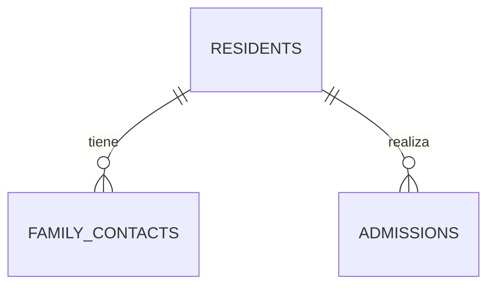

# Residentes: modelo inicial

Este documento define el alcance acordado para comenzar el módulo de residentes.
Es el diseño funcional que sirve de base para la primera migración SQL. La
aplicación todavía no consulta estas tablas.

## Objetivo de la primera entrega

La primera entrega permitirá:

1. Registrar los datos personales de un residente.
2. Registrar al menos un familiar o responsable.
3. Crear su primer ingreso con fecha, habitación y cuota mensual.
4. Mostrar al residente en el listado de residentes activos.

Quedan para entregas posteriores la carga de documentos, la información médica,
el inventario, el registro de pagos y el proceso de baja o reingreso.

## Reglas acordadas

- Un residente puede ingresar más de una vez a la institución.
- Una baja no elimina al residente ni su historial.
- Un residente solo puede tener un ingreso activo al mismo tiempo.
- Un ingreso está activo mientras no tenga una fecha de baja.
- La cuota se acuerda por ingreso y se paga mensualmente.
- Cada pago mensual se registrará por separado cuando se desarrolle ese módulo.
- Los documentos podrán cargarse principalmente como imágenes.
- La falta de un documento no impedirá registrar un ingreso; podrá quedar
  pendiente.
- Las imágenes y los datos médicos serán privados.

## Arquitectura por instalación

Cada geriátrico tendrá su propio proyecto de Supabase. Por lo tanto:

- Los datos, usuarios y archivos de distintos geriátricos estarán separados.
- Las tablas no necesitarán un campo `organization_id` para distinguir clientes.
- Todos los proyectos recibirán las mismas migraciones para conservar una
  estructura consistente.
- Cada instalación usará sus propias variables de entorno y credenciales; estas
  nunca se guardarán en Git.

## Por qué separamos residente e ingreso

`residents` representa a la persona y conserva sus datos aunque deje la
institución. `admissions` representa cada estadía. Esta separación permite dar de
baja a una persona y volver a ingresarla más adelante sin duplicar su identidad
ni perder información histórica.

## Tablas de la primera entrega

Los nombres técnicos están en inglés para mantener consistencia con el código.
La interfaz que verá el usuario estará en español.

### `residents`

Guarda los datos personales permanentes del residente.

| Campo | Tipo previsto | Obligatorio | Descripción |
| --- | --- | --- | --- |
| `id` | `uuid` | Sí | Identificador generado por Supabase. |
| `first_name` | `text` | Sí | Nombre. |
| `last_name` | `text` | Sí | Apellido. |
| `dni` | `text` | Sí | Documento de identidad; no se podrá repetir. |
| `birth_date` | `date` | Sí | Fecha de nacimiento, sin horario. |
| `phone` | `text` | No | Teléfono personal, si corresponde. |
| `address` | `text` | No | Domicilio anterior al ingreso. |
| `notes` | `text` | No | Observaciones generales no médicas. |
| `created_at` | `timestamptz` | Sí | Momento de creación del registro. |
| `updated_at` | `timestamptz` | Sí | Momento de la última modificación. |

El estado activo no se guardará también en esta tabla. Se calculará a partir de
la existencia de un ingreso sin fecha de baja, evitando dos datos que podrían
contradecirse.

### `family_contacts`

Guarda familiares, contactos de emergencia y responsables administrativos.
Un residente puede tener varios.

| Campo | Tipo previsto | Obligatorio | Descripción |
| --- | --- | --- | --- |
| `id` | `uuid` | Sí | Identificador del contacto. |
| `resident_id` | `uuid` | Sí | Residente al que pertenece. |
| `first_name` | `text` | Sí | Nombre del contacto. |
| `last_name` | `text` | Sí | Apellido del contacto. |
| `relationship` | `text` | Sí | Vínculo con el residente. |
| `phone` | `text` | Sí | Teléfono principal. |
| `is_emergency_contact` | `boolean` | Sí | Indica si es contacto de emergencia. |
| `is_payment_responsible` | `boolean` | Sí | Indica si es responsable del pago. |
| `notes` | `text` | No | Información administrativa adicional. |
| `created_at` | `timestamptz` | Sí | Momento de creación. |
| `updated_at` | `timestamptz` | Sí | Momento de la última modificación. |

El formulario exigirá al menos un contacto al crear el primer ingreso. Esta es
una regla del proceso de ingreso, no una característica aislada del contacto.

### `admissions`

Guarda cada estadía del residente en la institución.

| Campo | Tipo previsto | Obligatorio | Descripción |
| --- | --- | --- | --- |
| `id` | `uuid` | Sí | Identificador del ingreso. |
| `resident_id` | `uuid` | Sí | Persona que ingresa. |
| `admitted_at` | `date` | Sí | Fecha de ingreso. |
| `room` | `text` | No | Habitación asignada. |
| `monthly_fee` | `numeric` | Sí | Cuota mensual acordada inicialmente. |
| `currency` | `text` | Sí | Moneda de la cuota; inicialmente `ARS`. |
| `due_day` | `integer` | Sí | Día habitual de vencimiento mensual. |
| `administrative_notes` | `text` | No | Observaciones administrativas. |
| `discharged_at` | `date` | No | Fecha de baja; vacío mientras siga activo. |
| `discharge_reason` | `text` | No | Motivo de la baja. |
| `created_at` | `timestamptz` | Sí | Momento de creación. |
| `updated_at` | `timestamptz` | Sí | Momento de la última modificación. |

La base de datos deberá impedir que un residente tenga dos ingresos activos. La
fecha de baja no podrá ser anterior a la fecha de ingreso.

## Módulos previstos para después

Estas áreas forman parte del producto, pero no se implementarán en la primera
entrega:

- `payments`: un registro por pago mensual, asociado al ingreso.
- `resident_documents`: datos de cada documento y ruta de su imagen privada en
  Supabase Storage.
- `medical_indications`: indicaciones médicas vigentes e históricas.
- `medications`: medicamento, dosis, frecuencia, horarios y vigencia.
- `special_needs`: alimentación, alergias, movilidad y cuidados especiales.
- `inventory_items`: ropa, higiene y pertenencias entregadas en cada ingreso.

La forma exacta de estas tablas se definirá recién al comenzar cada módulo. Esto
evita tomar ahora decisiones sobre procesos que todavía no diseñamos.

## Seguridad prevista

- Las tablas usarán Row Level Security (RLS) antes de contener datos reales.
- Los documentos se guardarán en un bucket privado de Supabase Storage.
- La aplicación no incluirá claves administrativas de Supabase en el navegador.
- No se usarán datos reales de residentes durante las pruebas iniciales.

## Próximo paso

Revisar la migración
`supabase/migrations/20260804234104_create_initial_resident_tables.sql`. El
ensayo con `supabase db push --dry-run` confirmó que se ejecutaría después de la
migración base de `consulta` y no modificó la base remota. Una vez aprobada, se
aplicará al proyecto y se generarán los tipos TypeScript desde Supabase.
